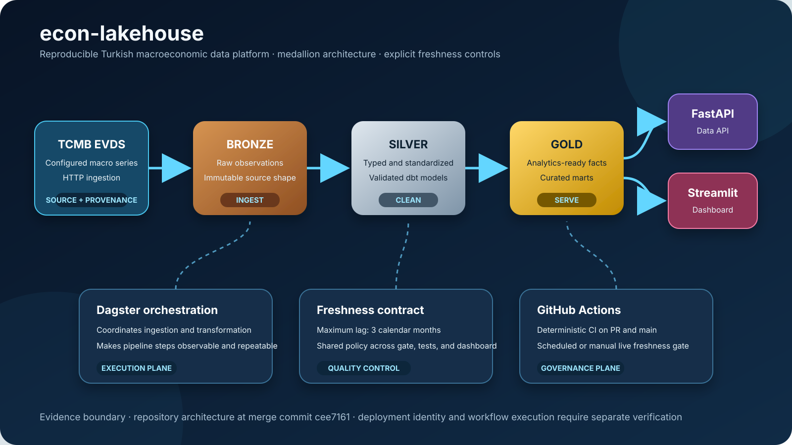

# econ-lakehouse architecture

The visual summarizes the repository-controlled data path and control plane at merge commit `cee7161255edc93e1846af947e2adffb91355063`.

For the component-level explanation, freshness contract, and evidence boundary, see [docs/architecture.md](docs/architecture.md).
